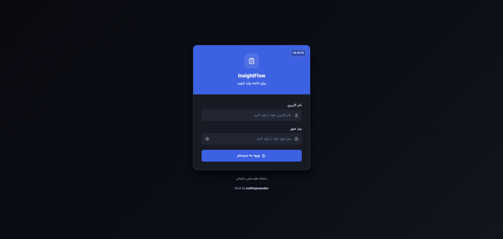
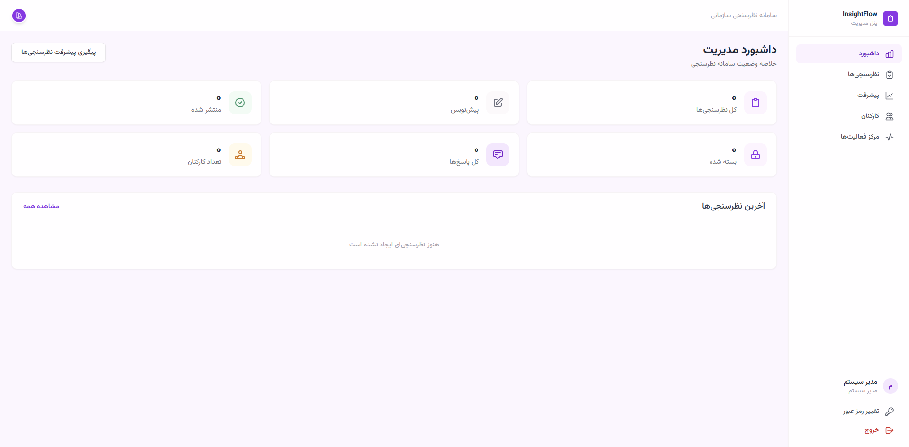
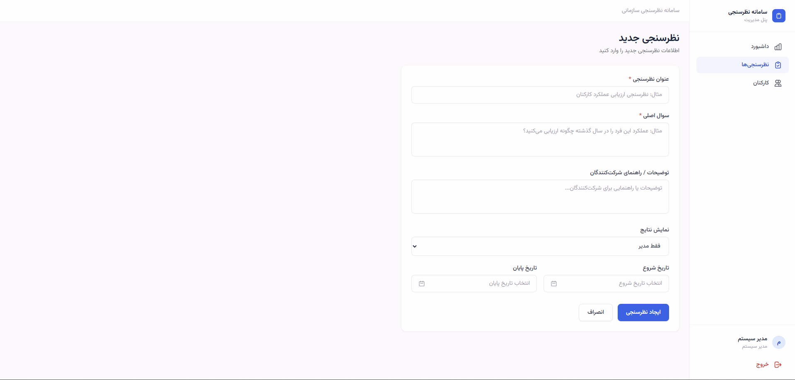
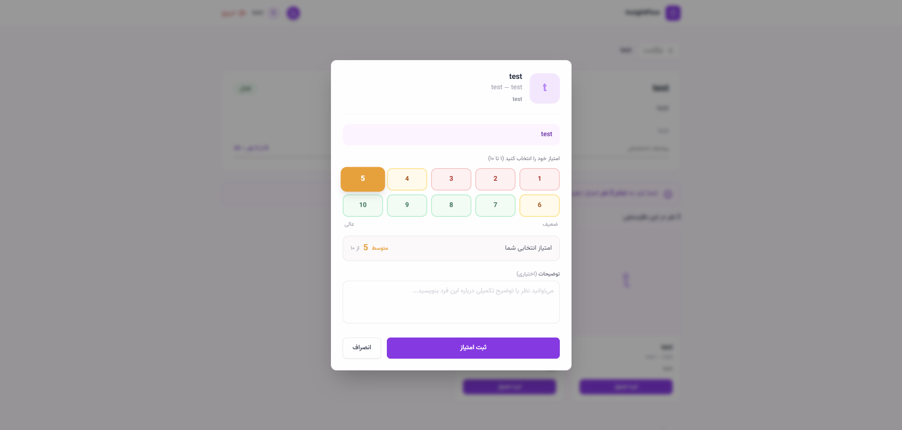
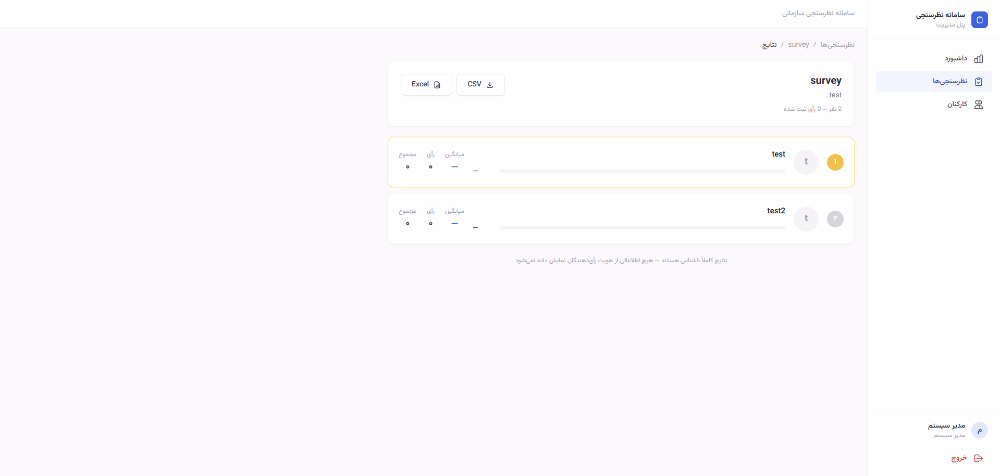
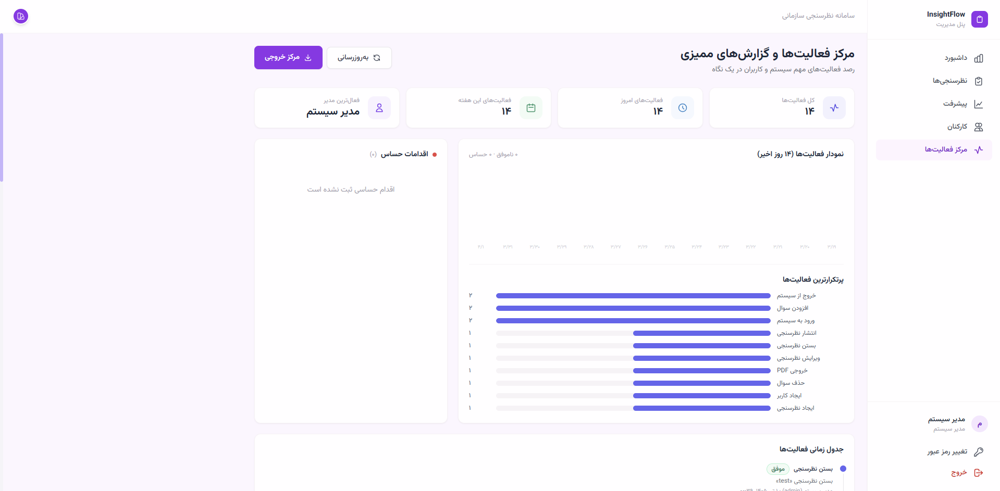

# InsightFlow


---


## UX Highlights

- Draft survey forms autosave locally while admins work.
- Draft surveys can be previewed before publishing.
- Survey lists and voting pages use skeleton loading states.
- Published and closed surveys clearly show that questions and people are locked.
- Mobile voting uses a tighter modal layout with sticky submit actions.

---<!-- ═══════════════════════════════════════════════════════════════════ PERSIAN -->
<div dir="rtl">

## سامانه مدرن نظرسنجی و ارزیابی سازمانی

**InsightFlow** یک پلتفرم داخلی برای مدیریت نظرسنجی‌های سازمانی، ارزیابی کارکنان و جمع‌آوری بازخورد است که کاملاً تحت وب اجرا می‌شود و نیاز به نصب هیچ نرم‌افزاری روی دستگاه کاربران ندارد.

[English version below ↓](#english)

---

## چرا InsightFlow؟

بسیاری از سازمان‌ها برای ارزیابی کارکنان از فایل‌های Excel، فرم‌های کاغذی یا ابزارهای پراکنده استفاده می‌کنند. InsightFlow یک سامانه متمرکز، ناشناس و امن ارائه می‌دهد که:

- 📊 نتایج به‌صورت **خودکار محاسبه و رتبه‌بندی** می‌شوند
- 🔒 رأی‌دهی کاملاً **ناشناس** است — مدیران فقط میانگین‌ها را می‌بینند
- 🏥 مناسب برای استقرار در **شبکه داخلی** (LAN) بیمارستان، شرکت یا اداره
- 📱 قابل استفاده از **هر دستگاهی** (موبایل، تبلت، لپ‌تاپ) فقط با مرورگر
- 🔍 **لاگ ممیزی** کامل با آدرس IP واقعی هر دستگاه (روی لینوکس)

---

## تصاویر پروژه

| صفحه ورود | داشبورد مدیریت |
|---|---|
|  |  |

| ساخت نظرسنجی چندسوالی | ثبت ارزیابی توسط کارمند |
|---|---|
|  |  |

| نتایج و رتبه‌بندی | مرکز فعالیت‌ها (لاگ ممیزی) |
|---|---|
|  |  |

---

## ویژگی‌های اصلی

### 👨‍💼 پنل مدیریت
- ساخت نظرسنجی با **سوالات چندگانه** (هر سوال می‌تواند امتیاز عددی، امتیاز ایموجی (بد/متوسط/خوب/عالی)، توضیح متنی، یا هر ترکیبی از این سه داشته باشد)
- افزودن افراد ارزیابی‌شونده با عکس، سمت و واحد سازمانی
- **ورود گروهی کارکنان** از طریق فایل CSV
- انتشار، بستن و تکثیر نظرسنجی‌ها
- مشاهده **پیشرفت پر شدن** نظرسنجی به‌صورت زنده (چه کسانی هنوز پاسخ نداده‌اند)
- مشاهده **نتایج ناشناس** با رتبه‌بندی، میانگین هر سوال، توزیع امتیاز ایموجی و نظرات متنی
- خروجی **PDF**، **Excel** و **CSV** از نتایج (شامل امتیاز عددی، امتیاز ایموجی و نظرات متنی)
- **مرکز فعالیت‌ها** — لاگ ممیزی کامل با فیلتر، جستجو و خروجی
- **کد QR برای لینک‌های ناشناس** — نمایش و دانلود کد QR هر لینک ناشناس برای اشتراک‌گذاری آسان (چاپ، پوستر، پیام‌رسان)؛ کد به‌صورت کامل در مرورگر ساخته می‌شود و نیازی به سرویس یا سرور جداگانه ندارد

### 👩‍⚕️ پنل کارمند
- مشاهده نظرسنجی‌های در دسترس
- ارزیابی هر فرد با پاسخ به تمام سوالات
- نمایش درصد پیشرفت (چند نفر را ارزیابی کرده‌ام)
- در اولین ورود، اجبار به تغییر رمز عبور

### 🛡️ امنیت
- احراز هویت JWT با **blacklist** کردن توکن هنگام خروج
- رمزهای عبور هاش‌شده — بدون محدودیت یا قانون پیچیدگی خاص (هر طول و ترکیبی پذیرفته می‌شود؛ انتخاب رمز قوی به‌عهده مدیر/کارمند است)
- محدودیت نوع و حجم فایل آپلودی
- هیچ اطلاعات رأی‌دهنده‌ای در نتایج ذخیره نمی‌شود
- **لاگ ممیزی** هر عملیات حساس

---

## تکنولوژی‌ها

| لایه | ابزار |
|---|---|
| Backend | Django 4.2 + Django REST Framework |
| Frontend | React 18 + TypeScript + Tailwind CSS |
| Database | PostgreSQL 15 |
| Cache | Redis 7 |
| Web Server | nginx (alpine) |
| App Server | Gunicorn |
| Container | Docker + Docker Compose |

**معماری درخواست:**
```
کاربر (مرورگر)
     │
     ▼
  nginx :80          ← تنها نقطه ورود عمومی
     │
     ├──▶ /api/*     ── gunicorn (Django)
     ├──▶ /static/*  ── فایل‌های استاتیک از volume
     ├──▶ /media/*   ── تصاویر آپلودی از volume
     └──▶ /*         ── React SPA
```

---

## پیش‌نیازها

- **Docker** و **Docker Compose** نصب‌شده
- حداقل **1 GB RAM** و **2 GB فضای دیسک**
- پورت **80** آزاد روی سرور

---

## راه‌اندازی سریع

### مرحله ۱ — کپی و ویرایش فایل `.env`

```bash
cp .env.example .env
nano .env   # یا هر ویرایشگر دیگری
```

مقادیر ضروری که **حتماً باید تغییر دهید**:

```ini
SECRET_KEY=یک-رشته-تصادفی-۵۰-کاراکتری-اینجا-بنویسید
DB_PASSWORD=رمز-عبور-قوی-برای-دیتابیس
ADMIN_PASSWORD=رمز-عبور-قوی-برای-مدیر

# آی‌پی یا نام سرور شما — مثال:
ALLOWED_HOSTS=192.168.1.100,myserver.local,localhost,127.0.0.1
CORS_ALLOWED_ORIGINS=http://192.168.1.100,http://myserver.local
```

برای ساخت `SECRET_KEY`:
```bash
python3 -c "import secrets; print(secrets.token_urlsafe(50))"
```

### مرحله ۲ — اجرا

```bash
./deploy.sh
```

همین. اسکریپت `deploy.sh` به‌صورت خودکار ایمیج‌ها را می‌سازد، کانتینرها را بالا می‌آورد و مایگریشن‌ها را اجرا می‌کند.

اگر اسکریپت اجرا نشد:
```bash
# Linux / Mac
bash deploy.sh

# Windows PowerShell
docker compose up -d --build
docker compose exec backend python manage.py migrate
```

### مرحله ۳ — ورود اولیه

مرورگر را باز کنید و به آدرس سرور بروید:
```
http://172.16.4.10
```

با اطلاعاتی که در `.env` تنظیم کردید (پیش‌فرض: `admin` / رمزی که نوشتید) وارد شوید.

---

## استقرار در شبکه داخلی (LAN)

### آدرس IP ثابت

آدرس IP سرور را ثابت کنید (از طریق تنظیمات شبکه سیستم‌عامل یا DHCP reservation در روتر).

### نام دوستانه به‌جای IP

اگر می‌خواهید کاربران به‌جای آدرس IP خام از یک نام دوستانه استفاده کنند:

**گزینه الف — DNS (بهترین روش):**
از تیم شبکه بخواهید یک رکورد A در DNS داخلی سازمان اضافه کنند:
```
myserver  →  192.168.1.100
```
(نام و IP را با مقادیر واقعی سرور خود جایگزین کنید)

**گزینه ب — نام سرور (فقط ویندوز):**
نام کامپیوتر سرور را به نام دلخواه تغییر دهید. کامپیوترهای ویندوزی در همان subnet از طریق NetBIOS به‌صورت خودکار آن را پیدا می‌کنند.

### آیا آی‌پی واقعی کلاینت در لاگ ثبت می‌شود؟

| سیستم‌عامل سرور | آی‌پی واقعی در لاگ ممیزی |
|---|---|
| **لینوکس** | ✅ بله — iptables سورس IP را حفظ می‌کند |
| **ویندوز (Docker Desktop)** | ❌ خیر — NAT لایه Hyper-V/WSL2 IP را بازنویسی می‌کند |

**اگر ثبت IP واقعی مهم است، سرور را روی لینوکس راه‌اندازی کنید.**

---

## دستورات مفید

```bash
# وضعیت کانتینرها
docker compose ps

# لاگ زنده backend
docker compose logs -f backend

# ریستارت
docker compose restart

# توقف کامل (داده‌ها حفظ می‌شوند)
docker compose down

# توقف + پاک کردن دیتابیس (برای شروع کاملاً تازه)
docker compose down -v

# بکاپ دیتابیس
docker compose exec db pg_dump -U surveyuser surveydb > backup_$(date +%F).sql

# ریستور دیتابیس
cat backup.sql | docker compose exec -T db psql -U surveyuser surveydb
```

---

<div dir="ltr">

## ساختار پروژه

```
insightflow/
├── backend/                  # Django backend
│   ├── apps/
│   │   ├── accounts/         # احراز هویت و مدیریت کاربران
│   │   ├── surveys/          # نظرسنجی‌ها، سوالات، رتبه‌بندی و خروجی‌ها
│   │   ├── activity/         # لاگ ممیزی (مرکز فعالیت‌ها)
│   │   └── core/             # ابزارهای مشترک (کش Redis)
│   ├── config/
│   │   ├── settings/
│   │   │   ├── base.py
│   │   │   ├── dev.py
│   │   │   └── prod.py
│   │   └── urls.py
│   └── requirements.txt
├── frontend/                 # React + TypeScript
│   └── src/
│       ├── api/              # axios client و endpoints
│       ├── components/       # کامپوننت‌های مشترک
│       ├── contexts/         # Auth و Theme context
│       ├── pages/
│       │   ├── admin/        # صفحات مدیر
│       │   └── employee/     # صفحات کارمند
│       └── types/            # TypeScript types
├── nginx/
│   └── nginx.conf            # تنظیمات reverse proxy
├── docker-compose.yml
├── deploy.sh                 # اسکریپت یک‌مرحله‌ای استقرار
├── .env.example
└── CHANGELOG.md
```
</div>

---

## رفع اشکال

| مشکل | راه حل |
|---|---|
| `backend` unhealthy | `docker compose logs backend --tail=50` |
| `password authentication failed` | `docker compose down -v` سپس دوباره اجرا کنید |
| پورت ۸۰ اشغال است | در `docker-compose.yml` پورت را به `8080:80` تغییر دهید |
| از LAN دسترسی نیست | IP سرور را به `ALLOWED_HOSTS` و `CORS_ALLOWED_ORIGINS` اضافه کنید |
| CORS error در مرورگر | آدرس دقیق (scheme + host) را به `CORS_ALLOWED_ORIGINS` اضافه کنید |
| خطای `relation does not exist` | مایگریشن اجرا نشده: `docker compose exec backend python manage.py migrate` |
| فایل‌های استاتیک لود نمی‌شوند | `docker compose exec backend python manage.py collectstatic --noinput` |

---

</div>
<!-- ═══════════════════════════════════════════════════════════════════ ENGLISH -->

---

<a name="english"></a>

## Modern Organizational Survey & Employee Evaluation Platform

**InsightFlow** is an internal web platform for managing organizational surveys, employee evaluations, and structured feedback collection — fully browser-based, no installation required on client devices.

---

## Why InsightFlow?

Most organizations still rely on Excel files, paper forms, or fragmented tools for employee evaluations. InsightFlow provides a centralized, anonymous, and secure alternative:

- 📊 Results are **automatically computed and ranked**
- 🔒 Voting is completely **anonymous** — managers see only aggregates
- 🏥 Designed for **LAN deployment** in hospitals, companies, and offices
- 📱 Works on **any device** (phone, tablet, laptop) — just a browser
- 🔍 Full **audit log** with real client IPs (on Linux)

---

## Screenshots

| Login Page | Admin Dashboard |
|---|---|
|  |  |

| Multi-Question Survey Builder | Employee Evaluation |
|---|---|
|  |  |

| Results & Rankings | Activity Center (Audit Log) |
|---|---|
|  |  |

---

## Features

### 👨‍💼 Admin Panel
- Create surveys with **multiple questions** — each question can have a numeric score (1–10), an emoji rating (بد/متوسط/خوب/عالی — bad/average/good/excellent), a text comment, or any combination of the three
- Add evaluated people with photo, job title, and department
- **Bulk import employees** from a CSV file
- Publish, close, and duplicate surveys
- Live **participation progress** — see exactly who hasn't voted yet
- View **anonymous results** — per-person rankings, per-question averages, emoji rating breakdowns, and text comments
- Export results as **PDF**, **Excel**, and **CSV** (including numeric scores, emoji ratings, and text comments)
- **Activity Center** — full audit log with filters, search, and export
- **QR codes for anonymous links** — view and download a QR code for each anonymous hash link, generated entirely client-side (no backend service required)

### 👩‍⚕️ Employee Panel
- See available surveys
- Rate each person by answering all questions
- Progress bar showing completion (how many people rated so far)
- Forced password change on first login

### 🛡️ Security
- JWT authentication with token **blacklisting on logout**
- Passwords are hashed — no length or complexity requirements are enforced (any length or character mix is accepted; choosing a strong password is left to the admin/employee)
- Upload type and size restrictions enforced
- No voter identity stored in results
- Every sensitive operation is **audit-logged**

---

## Technology Stack

| Layer | Technology |
|---|---|
| Backend | Django 4.2 + Django REST Framework |
| Frontend | React 18 + TypeScript + Tailwind CSS |
| Database | PostgreSQL 15 |
| Cache | Redis 7 |
| Web Server | nginx (alpine) |
| App Server | Gunicorn |
| Container | Docker + Docker Compose |

**Request flow:**
```
Browser (any device)
        │
        ▼
    nginx :80             ← single public entry point
        │
        ├──▶ /api/*       ── Gunicorn (Django)
        ├──▶ /static/*    ── static files from Docker volume
        ├──▶ /media/*     ── uploaded images from Docker volume
        └──▶ /*           ── React SPA
```

---

## Prerequisites

- **Docker** and **Docker Compose** installed
- At least **1 GB RAM** and **2 GB disk space**
- Port **80** free on the server

---

## Quick Start

### Step 1 — Configure `.env`

```bash
cp .env.example .env
nano .env     # or any editor
```

Values you **must** change:

```ini
SECRET_KEY=generate-a-50-char-random-string-here
DB_PASSWORD=your-strong-database-password
ADMIN_PASSWORD=your-strong-admin-password

# Your server's IP or hostname — examples:
ALLOWED_HOSTS=192.168.1.100,myserver.local,localhost,127.0.0.1
CORS_ALLOWED_ORIGINS=http://192.168.1.100,http://myserver.local
```

Generate a `SECRET_KEY`:
```bash
python3 -c "import secrets; print(secrets.token_urlsafe(50))"
```

### Step 2 — Deploy

```bash
./deploy.sh
```

That's it. The script builds images, starts all containers, and runs migrations automatically.

If the script doesn't run:
```bash
# Linux / Mac
bash deploy.sh

# Windows PowerShell
docker compose up -d --build
docker compose exec backend python manage.py migrate
```

### Step 3 — First login

Open a browser and go to your server's address:
```
http://172.16.4.10
```

Log in with the credentials you set in `.env` (default username: `admin`).

---

## LAN Deployment

### Fixed IP

Set a static IP on the server (via OS network settings or DHCP reservation on the router) so the address never changes.

### Friendly hostname instead of raw IP

If you want users to use a friendly name instead of a raw IP address:

**Option A — DNS record (recommended, works for all devices):**
Ask your network team to add an A record to the internal DNS:
```
myserver  →  192.168.1.100
```
Replace `myserver` and `192.168.1.100` with your actual server name and IP.

**Option B — Computer name (Windows clients, no DNS needed):**
Rename the server machine to your chosen name. Windows clients on the same subnet resolve it automatically via NetBIOS. For Linux/Mac clients use Avahi: `sudo apt install avahi-daemon`, then the server is reachable as `<hostname>.local`.

Make sure whatever name you use is added to both `ALLOWED_HOSTS` and `CORS_ALLOWED_ORIGINS` in `.env`.

### Will the real client IP appear in the audit log?

| Server OS | Real client IP (e.g. 172.16.4.55) in audit log |
|---|---|
| **Linux** | ✅ Yes — iptables DNAT preserves the source IP |
| **Windows (Docker Desktop)** | ❌ No — Hyper-V/WSL2 NAT rewrites it to a Docker gateway address |

**If real client IPs matter for your audit requirements, run the server on Linux.**

---

## Environment Variables

| Variable | Required | Description |
|---|---|---|
| `SECRET_KEY` | ✅ | Django secret key — generate a unique one |
| `DEBUG` | ✅ | `False` in production, `True` for local dev |
| `ALLOWED_HOSTS` | ✅ | Comma-separated hostnames/IPs the server responds to |
| `CORS_ALLOWED_ORIGINS` | ✅ | Comma-separated origins (scheme + host, no trailing slash) |
| `DB_NAME` | ✅ | PostgreSQL database name |
| `DB_USER` | ✅ | PostgreSQL username |
| `DB_PASSWORD` | ✅ | PostgreSQL password |
| `REDIS_URL` | ✅ | Redis connection URL |
| `ADMIN_USERNAME` | ✅ | First admin account username |
| `ADMIN_PASSWORD` | ✅ | First admin account password |
| `ADMIN_FULL_NAME` | ✅ | First admin account display name |
| `MAX_UPLOAD_SIZE` | — | Max upload size in bytes (default: 2097152 = 2 MB) |

---

## Useful Commands

```bash
# Check container status
docker compose ps

# Live backend logs
docker compose logs -f backend

# Restart all services
docker compose restart

# Stop (data is preserved)
docker compose down

# Stop and wipe database (fresh start)
docker compose down -v

# Backup database
docker compose exec db pg_dump -U surveyuser surveydb > backup_$(date +%F).sql

# Restore database
cat backup.sql | docker compose exec -T db psql -U surveyuser surveydb

# Run Django tests
docker compose exec backend python manage.py test apps.surveys apps.accounts apps.activity
```

---

## Project Structure

```
insightflow/
├── backend/                  # Django backend
│   ├── apps/
│   │   ├── accounts/         # Auth and user management
│   │   ├── surveys/          # Surveys, questions, ratings, exports
│   │   ├── activity/         # Audit log (Activity Center)
│   │   └── core/             # Shared utilities (Redis cache)
│   ├── config/
│   │   ├── settings/
│   │   │   ├── base.py
│   │   │   ├── dev.py
│   │   │   └── prod.py
│   │   └── urls.py
│   └── requirements.txt
├── frontend/                 # React + TypeScript
│   └── src/
│       ├── api/              # Axios client and endpoints
│       ├── components/       # Shared UI components
│       ├── contexts/         # Auth and Theme contexts
│       ├── pages/
│       │   ├── admin/        # Admin pages
│       │   └── employee/     # Employee pages
│       └── types/            # TypeScript type definitions
├── nginx/
│   └── nginx.conf            # Reverse proxy configuration
├── docker-compose.yml
├── deploy.sh                 # One-command deploy script
├── .env.example              # Environment variable template
└── CHANGELOG.md
```

---

## API Reference

### Authentication
| Method | Endpoint | Description |
|---|---|---|
| POST | `/api/auth/login/` | Login — returns access + refresh tokens |
| POST | `/api/auth/logout/` | Logout — blacklists the refresh token |
| POST | `/api/auth/refresh/` | Refresh access token |
| GET | `/api/auth/me/` | Get current user info |
| POST | `/api/auth/change-password/` | Change own password |

### Admin — User Management
| Method | Endpoint | Description |
|---|---|---|
| GET/POST | `/api/admin/users/` | List or create users |
| GET/PATCH | `/api/admin/users/<id>/` | Get or update a user |
| DELETE | `/api/admin/users/<id>/` | Delete a user |
| POST | `/api/admin/users/<id>/reset-password/` | Reset a user's password |
| POST | `/api/admin/users/<id>/activate/` | Activate a user |
| POST | `/api/admin/users/<id>/deactivate/` | Deactivate a user |
| POST | `/api/admin/users/bulk-import/` | Import users from CSV |

### Admin — Surveys
| Method | Endpoint | Description |
|---|---|---|
| GET/POST | `/api/admin/surveys/` | List or create surveys |
| GET/PATCH/DELETE | `/api/admin/surveys/<id>/` | Get, update or delete |
| POST | `/api/admin/surveys/<id>/publish/` | Publish a survey |
| POST | `/api/admin/surveys/<id>/close/` | Close a survey |
| POST | `/api/admin/surveys/<id>/duplicate/` | Duplicate a survey |
| GET | `/api/admin/surveys/<id>/results/` | Get anonymous results |
| GET | `/api/admin/surveys/<id>/comments/` | Paginated comments |
| GET | `/api/admin/surveys/<id>/export/csv/` | Export as CSV |
| GET | `/api/admin/surveys/<id>/export/excel/` | Export as Excel |
| GET | `/api/admin/surveys/<id>/export/pdf/` | Export as PDF |
| GET | `/api/admin/surveys/progress/` | Participation progress |
| GET | `/api/admin/dashboard/` | Dashboard stats |

### Activity Center (admin only)
| Method | Endpoint | Description |
|---|---|---|
| GET | `/api/admin/activity/logs/` | Paginated audit log |
| GET | `/api/admin/activity/stats/` | Headline KPIs |
| GET | `/api/admin/activity/charts/` | Daily chart data |
| GET | `/api/admin/activity/timeline/` | Recent activity timeline |
| GET | `/api/admin/activity/critical/` | Critical actions panel |
| GET | `/api/admin/activity/filters/` | Filter options |
| GET | `/api/admin/activity/export/` | Export log (CSV/Excel/PDF) |

### Employee
| Method | Endpoint | Description |
|---|---|---|
| GET | `/api/surveys/` | List available surveys |
| GET | `/api/surveys/<id>/` | Survey detail with people |
| POST | `/api/surveys/<id>/people/<pid>/rate/` | Submit ratings |
| GET | `/api/surveys/<id>/my-ratings/` | My completion status |

---

## Privacy & Anonymity

- Results show only aggregate scores — no voter names or identifiers
- The `Rating` model stores `voter_id` only for preventing duplicate votes (enforced at DB level with `unique_together`)
- Comments in results are detached from their authors
- Only voters who have **fully completed** a survey (all questions for all people) contribute to results

---

## Running Tests

```bash
# All tests inside Docker
docker compose exec backend python manage.py test apps.surveys apps.accounts apps.activity --verbosity=2

# Without Docker — use the dedicated test settings
# (disables throttles + uses LocMemCache so the suite never hits 429 errors)
cd backend
python manage.py test apps.surveys apps.accounts apps.activity \
  --settings=config.settings.test --verbosity=2

# End-to-end browser test (requires local Django + Vite running)
cd frontend
npm run e2e
```

> **Note:** always pass `--settings=config.settings.test` for local test runs.
> The `test.py` settings disable DRF throttles and use in-memory cache, which
> prevents spurious 429 failures when many login-heavy tests run in the same
> process. Using `dev.py` for tests can cause later test classes to be blocked
> by the shared login-rate-limit key.

---

## Local Development (without Docker)

### Backend
```bash
cd backend
python -m venv .venv && source .venv/bin/activate
pip install -r requirements.txt
cp ../.env.example ../.env   # fill in values
python manage.py migrate --settings=config.settings.dev
python manage.py runserver --settings=config.settings.dev
```

### Frontend
```bash
cd frontend
npm install
npm run dev    # Vite dev server on http://localhost:5173
```

The Vite proxy in `vite.config.ts` forwards `/api` and `/media` to `http://localhost:8000`.

---

## Troubleshooting

| Problem | Solution |
|---|---|
| `backend` container unhealthy | `docker compose logs backend --tail=50` |
| `password authentication failed` | Run `docker compose down -v` then restart — the old DB volume has a different password |
| Port 80 already in use | Change to `"8080:80"` in `docker-compose.yml` |
| Can't access from LAN | Add the server IP to `ALLOWED_HOSTS` and `CORS_ALLOWED_ORIGINS` in `.env` |
| CORS error in browser | The origin must match exactly — `http://192.168.1.100` not `http://192.168.1.100/` (no trailing slash) |
| `relation does not exist` on login | Migrations haven't run: `docker compose exec backend python manage.py migrate` |
| Static files not loading | `docker compose exec backend python manage.py collectstatic --noinput` |
| 502 Bad Gateway | Backend is still starting — wait 30s and refresh |
| Tests fail with `429 Too Many Requests` | Use `--settings=config.settings.test` instead of `dev` — test settings disable throttles |

---

## Author

Roham — Computer Engineering Student @ IUST
GitHub: [nothingness-dev](https://github.com/nothingness-dev)

---

## License

MIT License — Copyright © 2026 Roham
